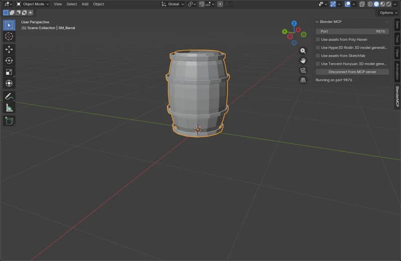
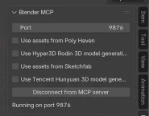
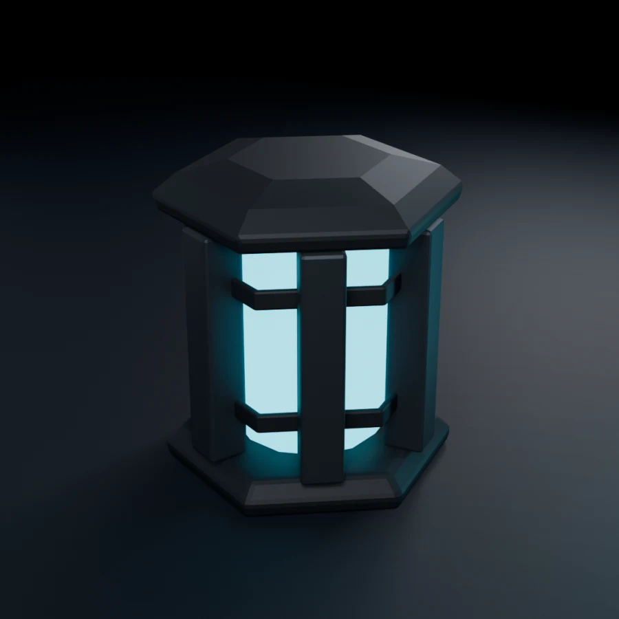
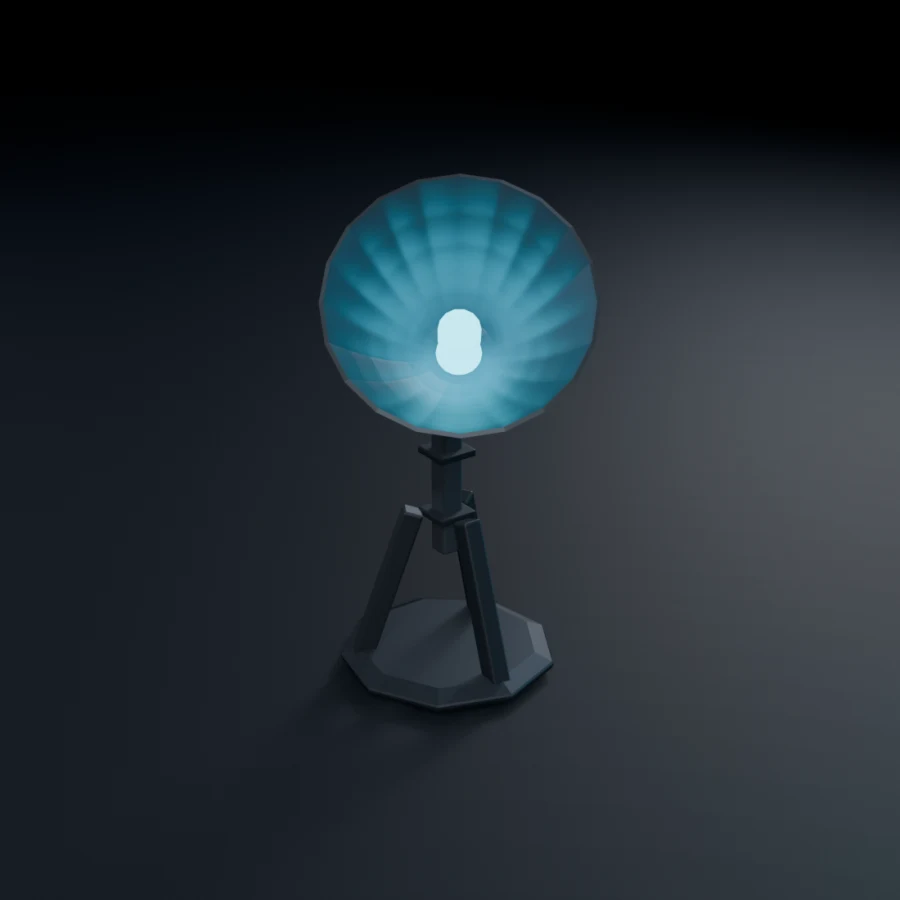
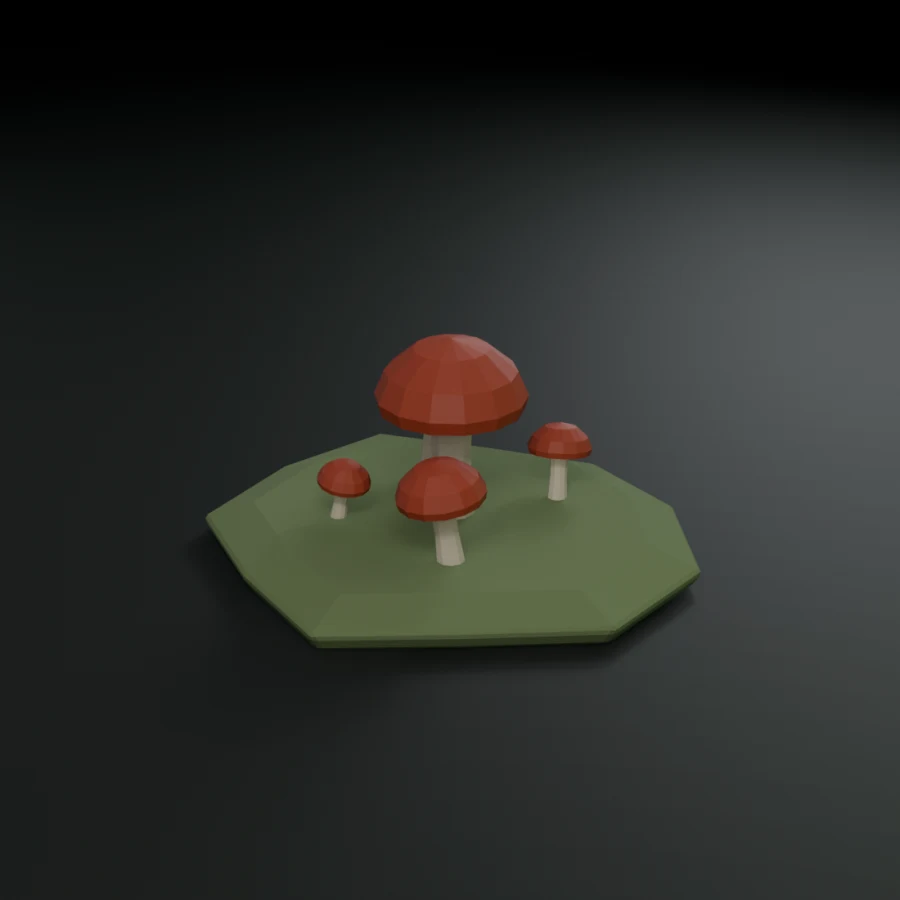

<p align="center">
  
</p>

<h1 align="center">blender-kiln — The 3D Asset Forge</h1>

<p align="center">
  <a href="LICENSE"></a>
  
  
  
  <a href="https://github.com/elithril/blender-kiln/stargazers"></a>
</p>

A complete 3D asset production pipeline for Claude Code, powered by Blender MCP.

From a text brief to an optimized, export-ready GLB — in one session.

<p align="center">
  
</p>

<p align="center">
  <sub>Reference assets built to this skill's conventions and reproducible from this repo — see <a href="#gallery">Gallery</a>.</sub>
</p>

## What it does

Kiln is a Claude Code skill that turns you into a 3D asset production studio. It orchestrates Blender (via MCP), AI generation (Hunyuan3D, Pollinations/FLUX), and marketplace search (PolyHaven, Sketchfab) into a single coherent pipeline.

```
[1] CONFIG → [2] BRIEF → [3] SOURCE → [4] IMPORT → [5] CLEANUP → [5b] TEXTURING → [6] OPTIMIZE → [7] EXPORT
```

### Pipeline phases

| Phase | What happens |
|---|---|
| **CONFIG** | Collect parameters: asset type, style, export target, detail tier |
| **BRIEF** | Reformulate and confirm understanding — enrich with reference image details if provided (user brief always wins over image) |
| **SOURCE** | Search marketplaces OR create via AI generation / scripted modeling / geometry nodes — reference image guides all methods |
| **IMPORT** | Import into Blender, verify scale (1 unit = 1m), center origin |
| **CLEANUP** | Merge doubles, recalc normals, apply transforms, check poly budget |
| **TEXTURING** | Geometric analysis + PolyHaven PBR, procedural materials, or bake from procedural |
| **OPTIMIZE** | gltf-transform (resize, WebP, Draco) and/or gltfpack (simplify, LOD) |
| **EXPORT** | GLB, FBX, USDZ — with validation checklist |

### Key features

- **Multi-method creation**: AI generation (Hunyuan3D 2.x — local or cloud), scripted modeling (Blender Python), geometry nodes, or marketplace sourcing
- **Local AI generation**: run Hunyuan3D-2 Mini on your machine — NVIDIA GPU for full pipeline, Apple Silicon for shape generation
- **Environment auto-detection**: `/kiln setup` scans your system and guides installation
- **Reference images**: provide an image per asset (path, URL, or drag-and-drop) — guides all creation methods (AI input, scripted proportions, texture assignment), enriches the brief, and enables post-export visual comparison
- **Concept art input**: text prompt (Pollinations/FLUX), image path, image URL, or nano-banana (optional)
- **Smart recommendations**: auto-suggests the best creation method based on asset type and style
- **Material audit**: detects procedural nodes that will be lost on GLTF export, proposes bake workflow
- **Post-export validation**: 8-point checklist (Babylon.js sandbox, Three.js console, material spot-check)
- **Character support**: T-pose enforcement, rigging patterns, bone validation, Blender 5.x bone collections
- **Multi-asset sessions**: cross-asset coherence (scale, materials, poly budget)
- **Batch mode**: wizard collects scene/theme/palette/reference images upfront, generates a YAML manifest, runner executes autonomously — ideal for overnight production or large asset sets
- **Full logging**: every asset produces a production log with copy-paste prompts

## Running over Blender MCP

The skill drives a live Blender through the [Blender MCP](https://github.com/ahujasid/blender-mcp)
addon. Below is `SM_Barrel` built, cleaned and exported inside a running Blender
session — object named to convention, sitting on Z=0, ready to export:

<p align="center">
  
</p>

The MCP pass and the headless scripted pass agree **to the byte** — 111.9 kB GLB
either way, same 2,202 triangles, same three materials.

### Check the integrations before you search



All four integrations ship **off**, as shown here. That matters more than it
looks: while an integration is off, the addon does not register its commands at
all, so a search does not come back "disabled" — it comes back

```
Unknown command type: search_polyhaven_assets
```

which reads like a version mismatch and sends you hunting for the wrong problem.

`get_polyhaven_status`, `get_sketchfab_status`, `get_hunyuan3d_status` and
`get_hyper3d_status` are registered unconditionally and return the fix step by
step — including the Sketchfab API key, which nothing else surfaces. **Iron rule
22** requires checking them first. Tick the boxes in the BlenderMCP panel of the
3D Viewport sidebar (press <kbd>N</kbd> if hidden), then reconnect.

<br clear="all" />

## Gallery

Fifteen props across three themes, modelled from scratch by script, cleaned,
audited, rendered and exported — all headless, on one laptop, with no cloud
service and no paid API.

<p align="center">
  
  
  
  
  
</p>

> **What this gallery is, and is not.** These assets were produced by the scripts
> in `examples/gallery/`, written to the skill's rules — see
> [Which rules the scripts obey](#which-rules-the-scripts-obey) for the audit.
>
> They were **not** produced by running the skill. The skill drives Blender over
> MCP and its core loop is interactive: `get_scene_info()` before each phase
> (rule 1), `get_viewport_screenshot()` after each modification (rule 2), and a
> prompt before anything destructive (rule 6). None of that is exercised here —
> this is `blender --background --python`, the scripted-modeling path only. Treat
> the gallery as reference output and a conventions check, not as end-to-end
> validation of the skill.

### What the OPTIMIZE phase actually buys

Measured, not estimated — these are the sizes the commands below produced:

**15 assets · 21,879 tris · 1456.2 kB raw → 132.7 kB after dedup/weld/Draco (91% smaller)**

#### Forge

| Asset | Object | Tris | GLB raw | + Draco | + meshopt | Saved |
|---|---|---:|---:|---:|---:|---:|
| `barrel` | `SM_Barrel` | 2,202 | 111.9 kB | 10.2 kB | 26.0 kB | **91%** |
| `crate` | `SM_Crate` | 1,836 | 128.6 kB | 9.7 kB | 20.9 kB | **92%** |
| `lantern` | `SM_Lantern` | 1,396 | 95.6 kB | 9.3 kB | 17.6 kB | **90%** |
| `anvil` | `SM_Anvil` | 888 | 62.9 kB | 6.5 kB | 11.5 kB | **90%** |
| `crystal` | `SM_CrystalCluster` | 722 | 40.7 kB | 5.3 kB | 11.5 kB | **87%** |
| **subtotal** | | **7,044** | **439.7 kB** | | | **91%** |

#### Sci-fi modular

| Asset | Object | Tris | GLB raw | + Draco | + meshopt | Saved |
|---|---|---:|---:|---:|---:|---:|
| `container` | `SM_CargoContainer` | 5,076 | 350.1 kB | 20.4 kB | 52.3 kB | **94%** |
| `canister` | `SM_Canister` | 2,114 | 139.7 kB | 11.5 kB | 24.0 kB | **92%** |
| `reactor` | `SM_ReactorCell` | 1,872 | 129.0 kB | 11.5 kB | 23.6 kB | **91%** |
| `relay` | `SM_AntennaRelay` | 1,638 | 115.0 kB | 11.2 kB | 21.1 kB | **90%** |
| `hexpad` | `SM_HexPad` | 772 | 41.7 kB | 6.0 kB | 10.9 kB | **86%** |
| **subtotal** | | **11,472** | **775.4 kB** | | | **92%** |

#### Stylised nature

| Asset | Object | Tris | GLB raw | + Draco | + meshopt | Saved |
|---|---|---:|---:|---:|---:|---:|
| `mushrooms` | `SM_Mushrooms` | 984 | 54.4 kB | 7.2 kB | 14.2 kB | **87%** |
| `tree` | `SM_Tree` | 774 | 67.0 kB | 7.4 kB | 14.5 kB | **89%** |
| `cactus` | `SM_Cactus` | 698 | 36.2 kB | 5.0 kB | 9.9 kB | **86%** |
| `stump` | `SM_Stump` | 587 | 49.4 kB | 7.2 kB | 11.6 kB | **85%** |
| `boulder` | `SM_Boulder` | 320 | 34.0 kB | 4.3 kB | 8.3 kB | **87%** |
| **subtotal** | | **3,363** | **241.0 kB** | | | **87%** |

Draco wins on size; gltfpack's meshopt output is roughly twice as large but
decodes faster on the client. Both are lossy, and both run as **individual
steps** — never `gltf-transform optimize`, per iron rule 20.

Two things the intermediate sizes will tell you if you read them closely:

- `weld` makes the file **bigger**. It is a preparation step for Draco, not a
  size win on its own — don't ship its output.
- Only Draco survives a round trip into Blender. Verified by re-importing every
  variant:

| Output | Re-imports into Blender |
|---|---|
| `_original.glb`, `_dedup.glb`, `_weld.glb` | yes, geometry intact |
| `_final.glb` (Draco) | yes — built-in decoder |
| `_packed.glb` (meshopt) | **no** — `EXT_meshopt_compression` unsupported |

`EXT_meshopt_compression` is a **web runtime** format: three.js and Babylon decode
it, Blender's glTF importer does not. That error on import is expected, not a
broken file — reach for `_final.glb` when you need the asset back in Blender, and
for `_packed.glb` when shipping to a viewer that decodes meshopt.

### Which rules the scripts obey

Audited against the iron rules and `references/`, honestly:

| Rule | Status | How |
|---|---|---|
| 3 — one asset at a time | yes | `build.py` handles exactly one per process |
| 4 — never hard-cap polys, alert out of range | yes | `studio.poly_budget()` classifies each asset into a `references/topology-rules.md` tier — 9 lightweight, 5 balanced, 1 detailed — and alerts only above the top ceiling. Nothing is ever blocked |
| 5 — never spend money | yes | everything local; no marketplace, no generation service |
| 7 / 16 — always keep the .blend, in the asset folder | yes | `<asset>/<asset>.blend` |
| 10 — apply transforms, merge doubles, recalc normals before export | yes | `studio.cleanup()`, in that order, before any export |
| 14 — 1 Blender unit = 1 m, verify | yes | asserted per asset, recorded in the log |
| 15 — naming conventions | yes | `SM_PascalCase` objects with matching `_Mesh` data-blocks, `M_Type_Variant` materials, kebab-case output files |
| 17 — track licences in the log | yes | `<asset>_log.md`, stating that everything is generated in-repo |
| 18 — never `export_apply=True` for GLTF | yes | explicitly `False` |
| 19 — material export audit before GLTF export | yes | `studio.material_audit()` scans for nodes GLTF drops; result recorded per asset |
| 20 — never `gltf-transform optimize` | yes | dedup → weld → draco as separate calls |
| 1 / 2 / 6 — scene info, screenshots, prompt before destroying | **no** | these are MCP-and-interactive by nature; a headless script has no session to prompt |
| 8 / 11 / 12 / 13 — HuggingFace fallback, concept art, AI views, T-pose | n/a | no AI generation and no characters in this gallery |

### Reproduce it

```bash
cd examples/gallery
./run_gallery.sh                      # all three themes
THEMES="forge nature" ./run_gallery.sh
```

Needs Blender 5.x, `gltf-transform`, `gltfpack` and `cwebp`.

`studio.py` holds the shared rig (sRGB→linear palette, three-point lighting with a
per-theme accent, camera fitting, cleanup, budget check, material audit, render,
GLB export). `assets.py` has one builder per prop plus the theme registry.
`build.py` drives a single asset and writes its log.

Two Blender API traps cost real debugging time here, because both fail silently:

- **Principled BSDF inputs are linear, not sRGB.** Feeding hex-picked values
  straight in washes everything out — linear `0.31` is sRGB `0.58`, so a magenta
  lands as pale pink and rich wood as light tan. `studio.srgb()` converts.
- **Writing `obj.location` does not refresh `obj.matrix_world`.** Read it in the
  same breath and you get the *previous* transform, so a "sit it on Z=0"
  correction computes `zmin = 0.0` and does nothing — leaving the asset
  half-buried under the ground plane. Flush with `view_layer.update()` first.

## Commands

| Command | Action |
|---|---|
| `/kiln` | Full pipeline (CONFIG → EXPORT) |
| `/kiln batch` | Batch wizard → manifest → autonomous multi-asset production |
| `/kiln batch run` | Execute/resume a batch manifest (`--all`, `--asset <name>`) |
| `/kiln setup` | Environment detection + guided setup |
| `/kiln models` | List/switch Hunyuan3D models |
| `/kiln status` | Show current pipeline state |
| `/kiln search` | Search PolyHaven/Sketchfab |
| `/kiln inspect` | Inspect a 3D file (stats, poly count, materials, bbox) |
| `/kiln cleanup` | Cleanup a mesh in Blender |
| `/kiln texture` | Texture an untextured mesh |
| `/kiln optimize` | Optimize a GLB with gltf-transform/gltfpack |
| `/kiln convert` | Convert between formats (GLB↔USDZ↔FBX) |
| `/kiln help` | List all commands and usage |

## Requirements

### Required

- **Blender 4.x+** with the [Blender MCP](https://github.com/ahujasid/blender-mcp) addon running (port 9876)

### 3D Generation (choose one or both)

| Backend | Install | GPU needed | Texture gen | Offline |
|---|---|---|---|---|
| **HF Spaces** (default) | `pip3 install gradio_client` | No (cloud) | Yes | No |
| **Local [Hunyuan3D-2](https://github.com/Tencent/Hunyuan3D-2)** | Run `/kiln setup` (~25 GB download) | Optional | CUDA only | Yes |

On Mac (Apple Silicon): local shape generation works via MPS, texture generation falls back to skill's Blender-based texturing.
On Windows + NVIDIA GPU: full pipeline runs locally — shape + texture, zero cloud dependency.

### Optional

- **nano-banana MCP** — alternative concept art generation via Gemini (requires API key with billing)
- **gltf-transform** — `npm install -g @gltf-transform/cli` (texture compression, Draco)
- **gltfpack** — `npm install -g gltfpack` (mesh simplification, LOD generation)
- **Sketchfab API token** — free account, for marketplace downloads
- ~~**Reality Converter** / **usdzconvert**~~ — not needed: Blender exports USDZ natively

## Installation

### As a Claude Code plugin (recommended)

```
/plugin marketplace add elithril/blender-kiln
/plugin install blender-kiln@blender-kiln
```

Then run `/kiln setup` to detect your environment and install what's missing.

### As a standalone skill

```bash
git clone https://github.com/elithril/blender-kiln.git ~/.claude/skills/blender-kiln
```

Restart Claude Code, then run `/kiln setup`.

### Layout

Once installed, the skill directory looks like this:

```
~/.claude/skills/blender-kiln/
├── SKILL.md
└── references/
    ├── ai-generation.md
    ├── batch-mode.md
    ├── setup-install.md
    ├── characters.md
    ├── cli-tools.md
    ├── export-targets.md
    ├── naming-conventions.md
    ├── sourcing-strategy.md
    ├── texturing-strategy.md
    ├── topology-rules.md
    ├── uv-materials.md
    └── validation-checklist.md
```

## Skill structure

| File | Content | Lines |
|---|---|---|
| `SKILL.md` | Main pipeline, iron rules, MCP tool surface, commands, setup | ~880 |
| `references/characters.md` | Rigging patterns, anti-patterns, export gotchas, Blender 5.x | ~640 |
| `references/batch-mode.md` | Batch wizard, runner, iron rules 22-26, manifest format | ~450 |
| `references/texturing-strategy.md` | 4 strategies + shader recipes + bake workflow | ~360 |
| `references/validation-checklist.md` | Geometry cleanup + material export audit | ~250 |
| `references/ai-generation.md` | Hunyuan3D 2.x (local + cloud), concept art (Pollinations/nano-banana) | ~270 |
| `references/export-targets.md` | GLB/FBX/USDZ settings, headless CLI, post-export checklist | ~240 |
| `references/cli-tools.md` | gltf-transform, gltfpack, LOD workflow, metrics | ~210 |
| `references/uv-materials.md` | UV unwrapping, PBR channel packing | ~160 |
| `references/naming-conventions.md` | Blender + GLTF name mapping + file conventions | ~150 |
| `references/topology-rules.md` | Poly budgets, quad rules, edge flow | ~90 |
| `references/setup-install.md` | Model selection, install commands, post-install validation | ~70 |
| `references/sourcing-strategy.md` | PolyHaven + Sketchfab search patterns | ~100 |

**Total: ~3,870 lines** of production-tested 3D pipeline knowledge.

## Continuous checks

`tools/verify_docs.py` runs on every push (`.github/workflows/verify.yml`) and
checks that this documentation is still true — text only, no Blender, a few
seconds:

- iron rules form one unbroken 1..N sequence across `SKILL.md` and `batch-mode.md`
- every cited `rule N` exists **and means what the citation claims**
- the rule count above matches reality, and every line count in the structure
  table is within 15% of the file it describes
- every referenced file exists, and none point outside the plugin directory
- every README image resolves
- no bare `pip install` (it fails on any PEP 668 Python)
- the plugin manifest is valid and its `source` is a real directory
- documented commands use the invocable `/kiln <sub>` form

`tools/test_verify_docs.py` seeds each of those regressions and asserts the
checker catches it — **12/12**. Every case is a mistake that was actually made
here, including two renumberings that left a reference pointing at the wrong rule.

`tools/verify_blender.py` (`.github/workflows/blender.yml`, weekly and on demand)
re-checks what needed Blender to establish — the documented `bpy` API still exists,
the Principled sockets the docs name are real, Rigify's deform-bone counts still
match the tiers PHASE 5c routes on, geometry nodes still need the modifier applied
before export, and USDZ still exports natively into a conforming archive. It also fails on any
Blender `DeprecationWarning` reached by the docs or the gallery — its first run
surfaced `Material.use_nodes`, slated for removal in 6.0. Each check guards a
shipped bug; this notices when a Blender release makes one wrong again.

## Iron rules

The skill enforces 31 rules (26 core + 5 batch-specific). Key ones:

1. Always `get_scene_info()` before each phase
2. Always `get_viewport_screenshot()` after each modification
3. Never hard-cap poly count — alert if out of range, never block
4. Never silently destroy — decimate/simplify always interactive
5. Always keep the .blend file — in compact mode, only original + final + .blend + log
6. Never `export_apply=True` for GLTF — modifiers balloon file size
7. Always run material export audit before GLTF export
8. Never use `gltf-transform optimize` — use individual steps
9. Always check integration status before searching a marketplace — a disabled
   integration answers `Unknown command type`, not "disabled"
10. Between batch assets, clear the scene by removing datablocks — never with
    `read_homefile()`, which resets the scene properties holding those flags
11. Rename every import to the naming convention, whatever its source — a
    marketplace download arrives under the source file's name
12. Frame the viewport before screenshotting it, or the verification shot shows
    an apparently empty scene
13. Never pick a rig without measuring vertices ÷ deform bones — a Rigify human
    needs ~3,200 vertices to be worth it

## Output

Two storage modes, configurable at pipeline start:

**Compact (default)** — minimal footprint, .blend is the recovery point:
```
generated-assets/
└── wooden-chair/
    ├── wooden-chair_original.glb
    ├── wooden-chair_final.glb
    ├── wooden-chair.blend
    └── wooden-chair_log.md
```

**Full** — all intermediate files for debug/comparison:
```
generated-assets/
└── wooden-chair/
    ├── wooden-chair_original.glb
    ├── wooden-chair_clean.glb
    ├── wooden-chair_textured.glb
    ├── wooden-chair_optimized.glb
    ├── wooden-chair_final.glb
    ├── wooden-chair.blend
    └── wooden-chair_log.md
```

**Batch mode** — assets grouped under a batch folder with manifest and report:
```
generated-assets/
└── batch-corporate-office-2026-04-02/
    ├── batch-manifest.yaml
    ├── batch-report.md
    ├── desk/
    ├── chair/
    └── keyboard/
```

At the end of a multi-asset session, Kiln proposes a cleanup of intermediate files with per-asset size breakdown.

## License

[MIT](LICENSE) © Nicolas Dolphens
