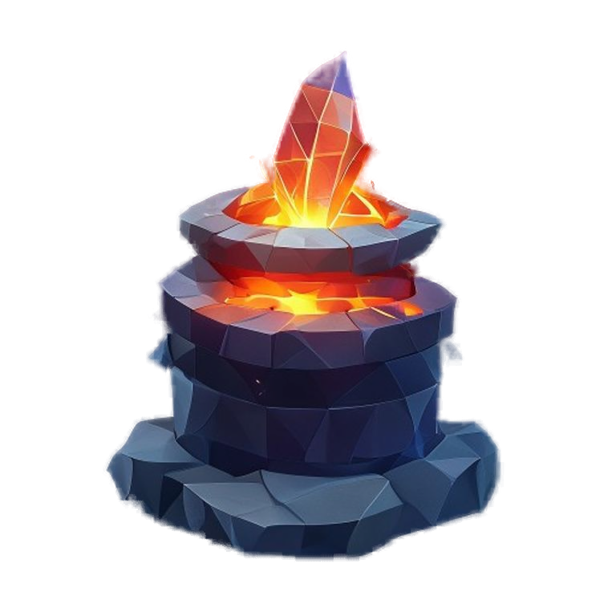
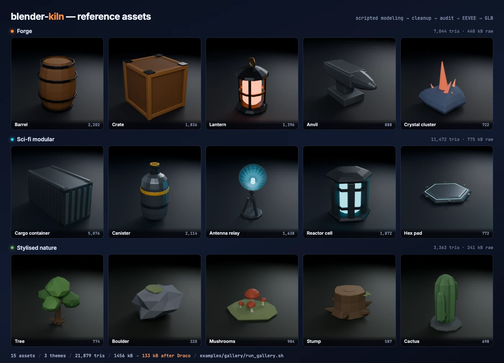
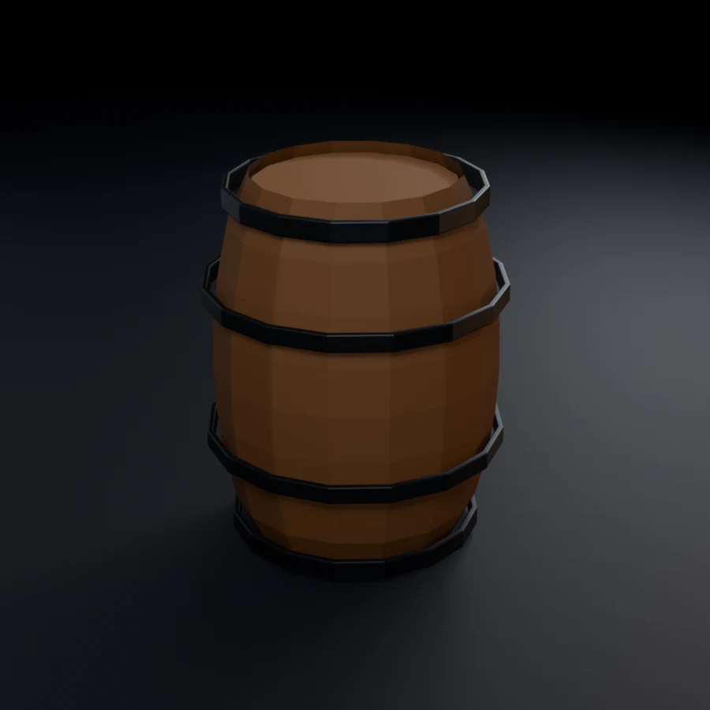
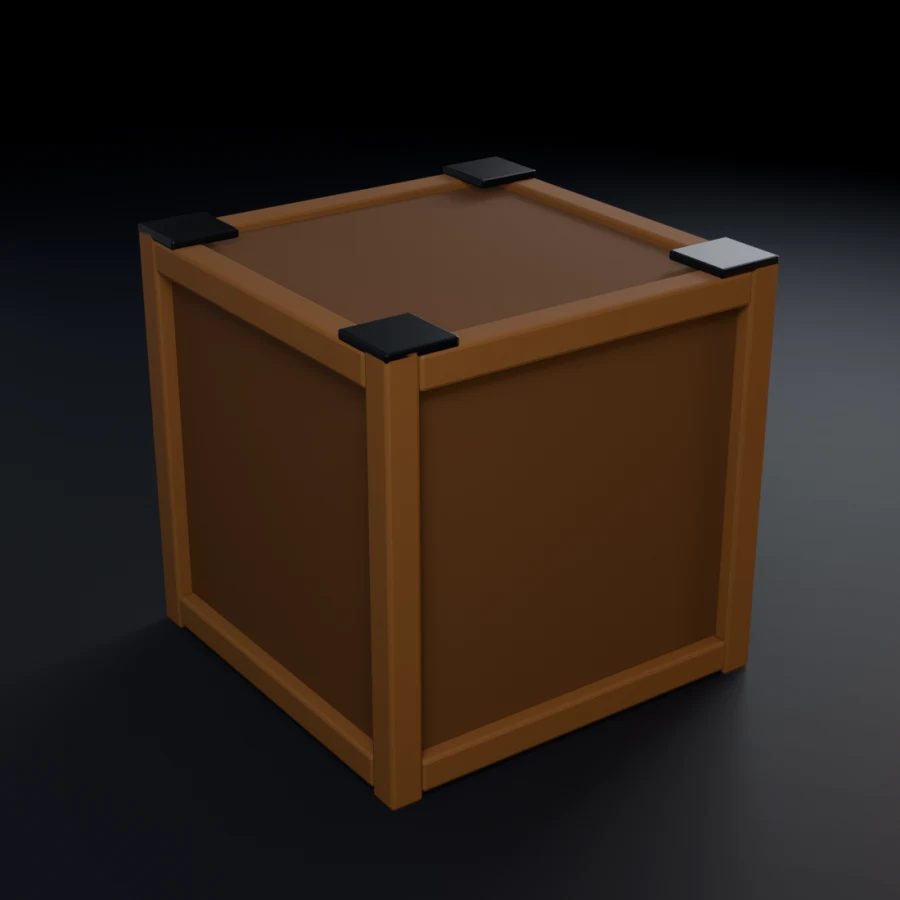
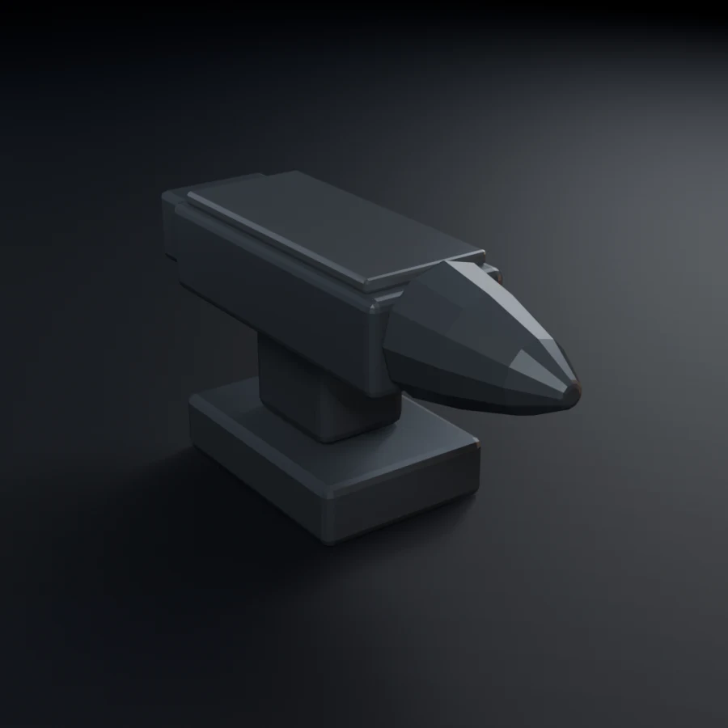
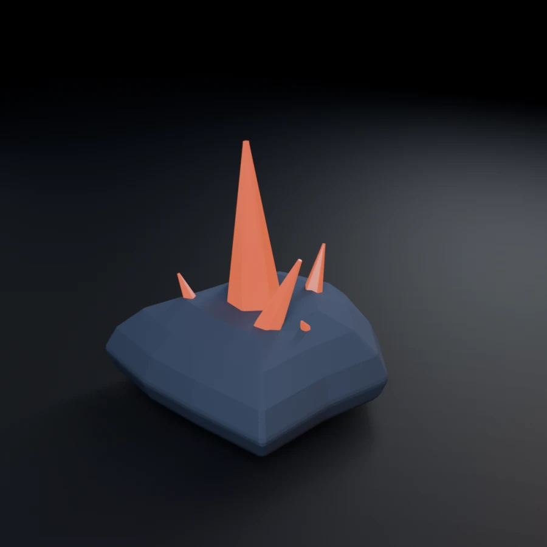

<p align="center">
  
</p>

<h1 align="center">blender-kiln — The 3D Asset Forge</h1>

<p align="center">
  <a href="LICENSE"></a>
  
  
  
  <a href="https://github.com/elithril/blender-kiln/stargazers"></a>
</p>

A complete 3D asset production pipeline for Claude Code, powered by Blender MCP.

From a text brief to an optimized, export-ready GLB — in one session.

<p align="center">
  
</p>

<p align="center">
  <sub>Every asset above was produced by this pipeline and is reproducible from this repo — see <a href="#gallery">Gallery</a>.</sub>
</p>

## What it does

Kiln is a Claude Code skill that turns you into a 3D asset production studio. It orchestrates Blender (via MCP), AI generation (Hunyuan3D, Pollinations/FLUX), and marketplace search (PolyHaven, Sketchfab) into a single coherent pipeline.

```
[1] CONFIG → [2] BRIEF → [3] SOURCE → [4] IMPORT → [5] CLEANUP → [5b] TEXTURING → [6] OPTIMIZE → [7] EXPORT
```

### Pipeline phases

| Phase | What happens |
|---|---|
| **CONFIG** | Collect parameters: asset type, style, export target, detail tier |
| **BRIEF** | Reformulate and confirm understanding — enrich with reference image details if provided (user brief always wins over image) |
| **SOURCE** | Search marketplaces OR create via AI generation / scripted modeling / geometry nodes — reference image guides all methods |
| **IMPORT** | Import into Blender, verify scale (1 unit = 1m), center origin |
| **CLEANUP** | Merge doubles, recalc normals, apply transforms, check poly budget |
| **TEXTURING** | Geometric analysis + PolyHaven PBR, procedural materials, or bake from procedural |
| **OPTIMIZE** | gltf-transform (resize, WebP, Draco) and/or gltfpack (simplify, LOD) |
| **EXPORT** | GLB, FBX, USDZ — with validation checklist |

### Key features

- **Multi-method creation**: AI generation (Hunyuan3D 2.x — local or cloud), scripted modeling (Blender Python), geometry nodes, or marketplace sourcing
- **Local AI generation**: run Hunyuan3D-2 Mini on your machine — NVIDIA GPU for full pipeline, Apple Silicon for shape generation
- **Environment auto-detection**: `/kiln setup` scans your system and guides installation
- **Reference images**: provide an image per asset (path, URL, or drag-and-drop) — guides all creation methods (AI input, scripted proportions, texture assignment), enriches the brief, and enables post-export visual comparison
- **Concept art input**: text prompt (Pollinations/FLUX), image path, image URL, or nano-banana (optional)
- **Smart recommendations**: auto-suggests the best creation method based on asset type and style
- **Material audit**: detects procedural nodes that will be lost on GLTF export, proposes bake workflow
- **Post-export validation**: 8-point checklist (Babylon.js sandbox, Three.js console, material spot-check)
- **Character support**: T-pose enforcement, rigging patterns, bone validation, Blender 5.x bone collections
- **Multi-asset sessions**: cross-asset coherence (scale, materials, poly budget)
- **Batch mode**: wizard collects scene/theme/palette/reference images upfront, generates a YAML manifest, runner executes autonomously — ideal for overnight production or large asset sets
- **Full logging**: every asset produces a production log with copy-paste prompts

## Gallery

Five props, modelled from scratch by script, cleaned, rendered and exported —
all headless, on one laptop, with no cloud service and no paid API.

<p align="center">
  
  
  
  
  
</p>

### What the OPTIMIZE phase actually buys

Measured, not estimated — these are the sizes the commands below produced:

| Asset | Tris | GLB raw | + dedup/weld/Draco | + gltfpack (meshopt) | Saved | Render |
|---|---:|---:|---:|---:|---:|---:|
| `barrel` | 2,202 | 107.2 kB | 13.0 kB | 25.9 kB | **88%** | 3.7 s |
| `crate` | 1,836 | 128.6 kB | 9.7 kB | 20.9 kB | **92%** | 3.5 s |
| `lantern` | 1,396 | 95.7 kB | 9.3 kB | 17.5 kB | **90%** | 3.8 s |
| `anvil` | 888 | 62.9 kB | 6.6 kB | 11.5 kB | **90%** | 3.8 s |
| `crystal` | 722 | 40.7 kB | 5.3 kB | 11.4 kB | **87%** | 3.8 s |
| **total** | **7,044** | **435.2 kB** | | | **90%** | |

Draco wins on size here; gltfpack's meshopt output is roughly twice as large but
decodes faster on the client. Both are lossy, and both are run as **individual
steps** — never `gltf-transform optimize`, per iron rule 8.

### Reproduce it

```bash
cd examples/gallery
./run_gallery.sh          # needs Blender 5.x, gltf-transform, gltfpack
```

`studio.py` holds the shared studio rig (palette, three-point lighting, camera
fitting, render, GLB export), `assets.py` one builder per prop, and `build.py`
drives a single asset through model → cleanup → render → export → metrics.

Two things worth knowing if you write your own builders, because both cost real
debugging time here:

- **Principled BSDF inputs are linear, not sRGB.** Feeding hex-picked values
  straight in washes everything out — linear `0.31` is sRGB `0.58`, so a magenta
  lands as pale pink. `studio.srgb()` does the conversion.
- **Writing `obj.location` does not refresh `obj.matrix_world`.** Read it in the
  same breath and you get the *previous* transform, so a "sit it on Z=0"
  correction silently does nothing and the asset ends up half-buried under the
  ground plane. Flush with `view_layer.update()` first.

## Commands

| Command | Action |
|---|---|
| `/kiln` | Full pipeline (CONFIG → EXPORT) |
| `/kiln batch` | Batch wizard → manifest → autonomous multi-asset production |
| `/kiln batch run` | Execute/resume a batch manifest (`--all`, `--asset <name>`) |
| `/kiln setup` | Environment detection + guided setup |
| `/kiln models` | List/switch Hunyuan3D models |
| `/kiln status` | Show current pipeline state |
| `/kiln search` | Search PolyHaven/Sketchfab |
| `/kiln inspect` | Inspect a 3D file (stats, poly count, materials, bbox) |
| `/kiln cleanup` | Cleanup a mesh in Blender |
| `/kiln texture` | Texture an untextured mesh |
| `/kiln optimize` | Optimize a GLB with gltf-transform/gltfpack |
| `/kiln convert` | Convert between formats (GLB↔USDZ↔FBX) |
| `/kiln help` | List all commands and usage |

## Requirements

### Required

- **Blender 4.x+** with the [Blender MCP](https://github.com/ahujasid/blender-mcp) addon running (port 9876)

### 3D Generation (choose one or both)

| Backend | Install | GPU needed | Texture gen | Offline |
|---|---|---|---|---|
| **HF Spaces** (default) | `pip3 install gradio_client` | No (cloud) | Yes | No |
| **Local [Hunyuan3D-2](https://github.com/Tencent/Hunyuan3D-2)** | Run `/kiln setup` (~25 GB download) | Optional | CUDA only | Yes |

On Mac (Apple Silicon): local shape generation works via MPS, texture generation falls back to skill's Blender-based texturing.
On Windows + NVIDIA GPU: full pipeline runs locally — shape + texture, zero cloud dependency.

### Optional

- **nano-banana MCP** — alternative concept art generation via Gemini (requires API key with billing)
- **gltf-transform** — `npm install -g @gltf-transform/cli` (texture compression, Draco)
- **gltfpack** — `npm install -g gltfpack` (mesh simplification, LOD generation)
- **Sketchfab API token** — free account, for marketplace downloads
- **Reality Converter** / **usdzconvert** — USDZ export (macOS)

## Installation

### As a Claude Code plugin (recommended)

```
/plugin marketplace add elithril/blender-kiln
/plugin install blender-kiln@blender-kiln
```

Then run `/kiln setup` to detect your environment and install what's missing.

### As a standalone skill

```bash
git clone https://github.com/elithril/blender-kiln.git ~/.claude/skills/blender-kiln
```

Restart Claude Code, then run `/kiln setup`.

### Layout

Once installed, the skill directory looks like this:

```
~/.claude/skills/blender-kiln/
├── SKILL.md
└── references/
    ├── ai-generation.md
    ├── batch-mode.md
    ├── setup-install.md
    ├── characters.md
    ├── cli-tools.md
    ├── export-targets.md
    ├── naming-conventions.md
    ├── sourcing-strategy.md
    ├── texturing-strategy.md
    ├── topology-rules.md
    ├── uv-materials.md
    └── validation-checklist.md
```

## Skill structure

| File | Content | Lines |
|---|---|---|
| `SKILL.md` | Main pipeline, iron rules, MCP tool surface, commands, setup | ~710 |
| `references/characters.md` | Rigging patterns, anti-patterns, export gotchas, Blender 5.x | ~430 |
| `references/batch-mode.md` | Batch wizard, runner, iron rules 22-26, manifest format | ~410 |
| `references/texturing-strategy.md` | 4 strategies + shader recipes + bake workflow | ~340 |
| `references/validation-checklist.md` | Geometry cleanup + material export audit | ~250 |
| `references/ai-generation.md` | Hunyuan3D 2.x (local + cloud), concept art (Pollinations/nano-banana) | ~220 |
| `references/export-targets.md` | GLB/FBX/USDZ settings, headless CLI, post-export checklist | ~210 |
| `references/cli-tools.md` | gltf-transform, gltfpack, LOD workflow, metrics | ~210 |
| `references/uv-materials.md` | UV unwrapping, PBR channel packing | ~155 |
| `references/naming-conventions.md` | Blender + GLTF name mapping + file conventions | ~150 |
| `references/topology-rules.md` | Poly budgets, quad rules, edge flow | ~90 |
| `references/setup-install.md` | Model selection, install commands, post-install validation | ~65 |
| `references/sourcing-strategy.md` | PolyHaven + Sketchfab search patterns | ~65 |

**Total: ~3,250 lines** of production-tested 3D pipeline knowledge.

## Iron rules

The skill enforces 28 rules (23 core + 5 batch-specific). Key ones:

1. Always `get_scene_info()` before each phase
2. Always `get_viewport_screenshot()` after each modification
3. Never hard-cap poly count — alert if out of range, never block
4. Never silently destroy — decimate/simplify always interactive
5. Always keep the .blend file — in compact mode, only original + final + .blend + log
6. Never `export_apply=True` for GLTF — modifiers balloon file size
7. Always run material export audit before GLTF export
8. Never use `gltf-transform optimize` — use individual steps
9. Always check integration status before searching a marketplace — a disabled
   integration answers `Unknown command type`, not "disabled"

## Output

Two storage modes, configurable at pipeline start:

**Compact (default)** — minimal footprint, .blend is the recovery point:
```
generated-assets/
└── wooden-chair/
    ├── wooden-chair_original.glb
    ├── wooden-chair_final.glb
    ├── wooden-chair.blend
    └── wooden-chair_log.md
```

**Full** — all intermediate files for debug/comparison:
```
generated-assets/
└── wooden-chair/
    ├── wooden-chair_original.glb
    ├── wooden-chair_clean.glb
    ├── wooden-chair_textured.glb
    ├── wooden-chair_optimized.glb
    ├── wooden-chair_final.glb
    ├── wooden-chair.blend
    └── wooden-chair_log.md
```

**Batch mode** — assets grouped under a batch folder with manifest and report:
```
generated-assets/
└── batch-corporate-office-2026-04-02/
    ├── batch-manifest.yaml
    ├── batch-report.md
    ├── desk/
    ├── chair/
    └── keyboard/
```

At the end of a multi-asset session, Kiln proposes a cleanup of intermediate files with per-asset size breakdown.

## License

[MIT](LICENSE) © Nicolas Dolphens
