<p align="center">
  
</p>

<h1 align="center">blender-kiln — The 3D Asset Forge</h1>

<p align="center">
  <a href="https://github.com/elithril/blender-kiln/actions/workflows/verify.yml"></a>
  <a href="https://github.com/elithril/blender-kiln/actions/workflows/blender.yml"></a>
  <a href="LICENSE"></a>
  
  
  <a href="https://github.com/elithril/blender-kiln/stargazers"></a>
</p>

**A Claude Code skill that turns a text brief — or a photo — into a production-ready GLB
through Blender.** Blender MCP servers give an agent hands in Blender; kiln gives it the
production method on top — sourcing, cleanup, texturing, optimization, validation,
export — and works on both of them: [ahujasid's `mcp-for-blender`](https://github.com/ahujasid/mcp-for-blender)
and the Blender Foundation's [official Blender Lab MCP](https://projects.blender.org/lab/blender_mcp),
the server behind Claude's Blender connector.

<sub>Cited in <a href="https://arxiv.org/abs/2606.01057"><i>3DCodeBench: Benchmarking Agentic Procedural 3D Modeling Via Code</i></a> (Google DeepMind, USC, 2026), §1.</sub>

<p align="center">
  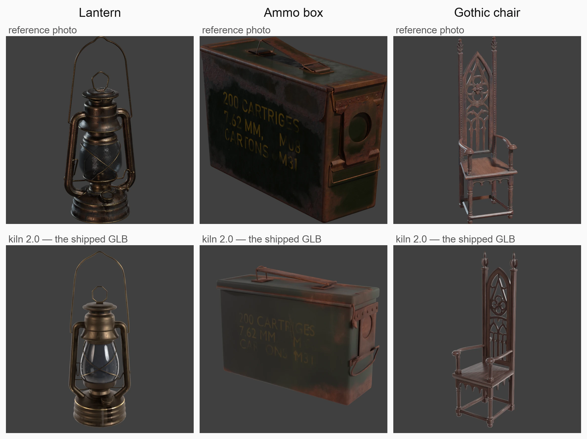
</p>
<p align="center"><sub>From one photo each, no marketplace, no AI generation: scripted in Blender, textured from CC0 scans,
measured against the real object. Shape scores against the real assets: <b>0.897</b>, <b>0.950</b>, <b>0.750</b> —
<a href="docs/benchmarks.md">how they are measured</a>.</sub></p>

## Quickstart

```
/plugin marketplace add elithril/blender-kiln
/plugin install blender-kiln@blender-kiln
/kiln setup
/kiln A hanging iron lantern for a medieval inn, stylized, for the web
```

`/kiln setup` detects Blender, the MCP server and the optional tools, and says what
is missing. Blender 4.4+ with a Blender MCP running — see [Requirements](#requirements).
Give it a photo and it rebuilds the object: `/kiln Rebuild the lamp in ./lamp.png as a game asset`.

## How it works, from a photo

<p align="center">
  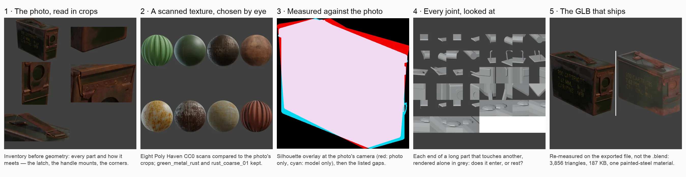
</p>
<p align="center"><sub>Every panel is a file the session itself wrote while rebuilding the ammo box above — nothing re-staged.</sub></p>

1. **Read the photo before modeling.** An inventory of every part and how it meets the next,
   from enlarged crops; the real size, the camera's height and angle — asked, or stated as
   assumptions. Given a 3D mesh generated from the same photo, its proportions are measured
   instead ([TRELLIS.2, locally](plugin/references/ai-generation.md)) — never shipped.
2. **Texture from scans, not noise.** A Poly Haven CC0 texture set of the material family,
   chosen by eye against the photo, tinted to its palette, worn by the form.
3. **Measure against the photo.** [`plugin/tools/fidelity_check.py`](plugin/tools/fidelity_check.py) renders
   the model at the photo's camera under a studio light and lists the gaps — silhouette per
   height band, materials, metal that cannot exist.
4. **Look at every joint.** Each end of a long part that touches another is rendered alone: a
   part that joins another enters it.
5. **Ship, and measure the file that ships.** Optimized (Draco, WebP), validated, re-measured
   as a GLB — what the user gets, not the `.blend`.

## Measured, not claimed

A [quality bench](bench/README.md) runs the skill headless, each session in a sandbox,
and measures every GLB it ships after re-importing it. Photo references are Poly Haven
previews, so the real 3D asset exists: each rebuild is scored against it from five sides —
an asset the session never sees. Blender 5.2.2, Opus 5.5, one run each:

| From a photo | before the photo method | **kiln 2.0** | shipped | cost |
|---|---:|---:|---:|---:|
| Hurricane lantern | 0.830 | **0.897** | 229 KB | $5.04 |
| Ammo box | 0.854 | **0.950** | 187 KB | $3.80 |
| Gothic chair | 0.445 | **0.750** | 239 KB | $6.13 |

| Five text briefs, before → after | ahujasid MCP | Official Lab MCP |
|---|---:|---:|
| Shipped | 32.9 MB → **0.96 MB** | 3.9 MB → **0.75 MB** |
| Final GLBs compressed (Draco, WebP) | 0 of 7 → **7 of 7** | 0 of 7 → **7 of 7** |
| Defects the measure found | 2 → 1 | 2 → **0** |
| Cost for the five (API-equivalent) | $6.49 → $7.34 | $5.82 → $7.81 |

<sub>Shape score: silhouette overlap with the real asset from front, back, sides and top, 1 = identical;
openwork views left out for the chair. The text briefs were measured on the skill mid-way through
2.0 (`2b313d2`), the photo rebuilds on the final one. Size is assumed when a brief gives none —
the chair came out at an ordinary chair's height, 29 % short.</sub>

What did not improve is published too: the [benchmarks](docs/benchmarks.md) — fifteen
versions of one lantern, what each fix broke, how the bench was kept honest — and every
number, render and GLB under 1 MB on the [`bench-results`](https://github.com/elithril/blender-kiln/tree/bench-results) branch — kept
out of `main` so that installing the plugin does not download them.

## What it does

Kiln is a Claude Code skill that turns you into a 3D asset production studio. It orchestrates Blender (via MCP), AI generation (Hunyuan3D, FLUX.1-schnell concept art), and marketplace search (PolyHaven, Sketchfab) into a single coherent pipeline.

```
[1] CONFIG → [2] BRIEF → [3] SOURCE → [4] IMPORT → [5] CLEANUP → [5b] TEXTURING → [6] OPTIMIZE → [7] EXPORT
```

### Pipeline phases

| Phase | What happens |
|---|---|
| **CONFIG** | Collect parameters: asset type, style, export target, detail tier |
| **BRIEF** | Reformulate and confirm understanding — enrich with reference image details if provided (user brief always wins over image) |
| **SOURCE** | Search marketplaces OR create via AI generation / scripted modeling / geometry nodes — reference image guides all methods |
| **IMPORT** | Import into Blender, verify scale (1 unit = 1m), center origin |
| **CLEANUP** | Merge doubles, recalc normals, apply transforms, check poly budget |
| **TEXTURING** | Geometric analysis + PolyHaven PBR, procedural materials, or bake from procedural |
| **RIG** | Characters: a skeleton sized to the mesh, joints at the bends, weights checked on a bent pose |
| **ANIMATE** | Optional, routed by subject: the asset's own clips; scripted idle/walk for quadrupeds; UniMate text-to-motion for bipeds and winged creatures, looped (non-commercial weights); keyed rigid parts for articulated objects |
| **OPTIMIZE** | gltf-transform (resize, WebP, Draco) and/or gltfpack (simplify, LOD) |
| **EXPORT** | GLB, FBX, USDZ — with validation checklist |

### Key features

- **Rebuild from a photo, measured**: an inventory from enlarged crops, the size and camera settled first, the silhouette and materials measured against the photo, every joint rendered and looked at, the last measure on the shipped GLB ([how](plugin/references/reference-fidelity.md))
- **Textures from CC0 scans**: Poly Haven texture sets chosen against the photo, tinted to its palette, worn by the form, baked to UVs — procedural only when no scan fits
- **A 3D template when one exists**: proportions read off a mesh generated from the same photo (TRELLIS.2, run locally) with `plugin/tools/template_profile.py` — measured, never shipped
- **Both Blender MCP servers**: ahujasid's `mcp-for-blender` and the Blender Foundation's official Lab MCP, the one behind Claude's Blender connector
- **Multi-method creation**: AI generation (Hunyuan3D 2.x — local or cloud), scripted modeling (Blender Python), geometry nodes, or marketplace sourcing
- **Local AI generation**: run Hunyuan3D-2 Mini on your machine — NVIDIA GPU for full pipeline, Apple Silicon for shape generation
- **Environment auto-detection**: `/kiln setup` scans your system and guides installation
- **Reference images**: provide an image per asset (path, URL, or drag-and-drop) — guides all creation methods (AI input, scripted proportions, texture assignment), enriches the brief, and enables post-export visual comparison
- **Concept art input**: text prompt (FLUX.1-schnell HF Space, free), image path, image URL, or nano-banana (optional)
- **Smart recommendations**: auto-suggests the best creation method based on asset type and style
- **Material audit**: detects procedural nodes that will be lost on GLTF export, proposes bake workflow
- **Optimized by default**: `_final.glb` ships with Draco geometry and WebP textures, re-measured after compression; the uncompressed `_original.glb` is kept
- **Post-export validation**: 8-point checklist (Babylon.js sandbox, Three.js console, material spot-check)
- **Character support**: T-pose enforcement, an animation-ready skeleton (joints at the bends, checked on a bent pose), bone validation, Blender 5.x bone collections
- **Animation, routed by subject** ([see above](#animate)): scripted idle/walk cycles for quadrupeds, UniMate text-to-motion for bipeds and winged creatures — pinned version, weekly drift check, seamless loops — and keyed articulated props
- **Multi-asset sessions**: cross-asset coherence (scale, materials, poly budget)
- **Batch mode**: wizard collects scene/theme/palette/reference images upfront, generates a YAML manifest, runner executes autonomously — ideal for overnight production or large asset sets
- **Full logging**: every asset produces a production log with copy-paste prompts

## Running over Blender MCP

The skill drives a live Blender through the [Blender MCP](https://github.com/ahujasid/mcp-for-blender)
addon. Below is `SM_Barrel` built, cleaned and exported inside a running Blender
session — object named to convention, sitting on Z=0, ready to export:

<p align="center">
  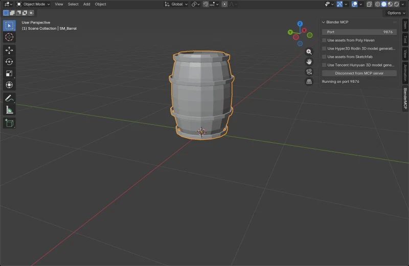
</p>

The MCP pass and the headless scripted pass agree **to the byte** — 111.9 kB GLB
either way, same 2,202 triangles, same three materials.

### Check the integrations before you search

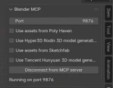

All four integrations ship **off**, as shown here. That matters more than it
looks: while an integration is off, the addon does not register its commands at
all, so a search does not come back "disabled" — it comes back

```
Unknown command type: search_polyhaven_assets
```

which reads like a version mismatch and sends you hunting for the wrong problem.

`get_polyhaven_status`, `get_sketchfab_status`, `get_hunyuan3d_status` and
`get_hyper3d_status` are registered unconditionally and return the fix step by
step — including the Sketchfab API key, which nothing else surfaces. **Iron rule
23** requires checking them first. Tick the boxes in the BlenderMCP panel of the
3D Viewport sidebar (press <kbd>N</kbd> if hidden), then reconnect.

<br clear="all" />

## Gallery

<p align="center">
  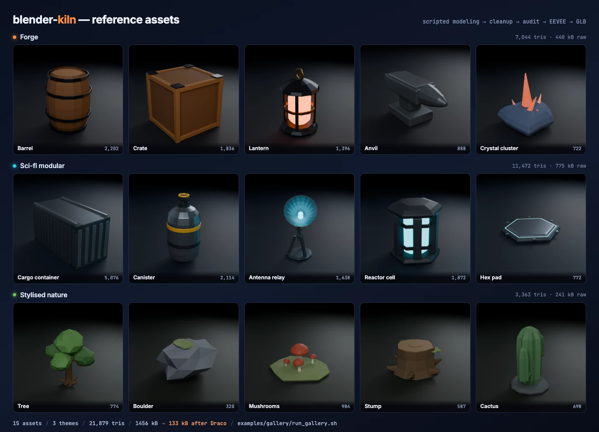
</p>

Fifteen props across three themes, modelled from scratch by script, cleaned,
audited, rendered and exported — all headless, on one laptop, with no cloud
service and no paid API.

<p align="center">
  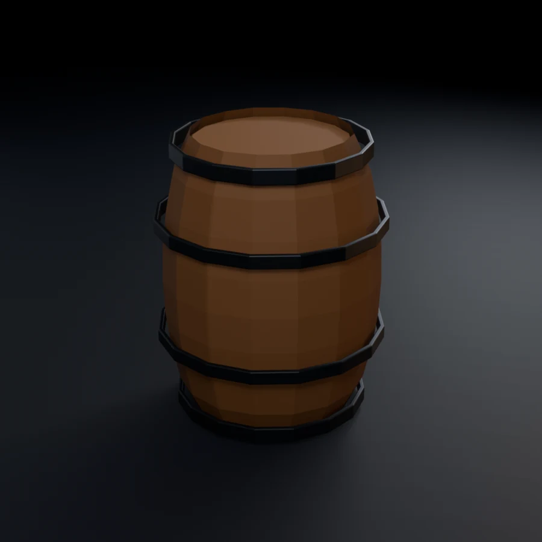
  
  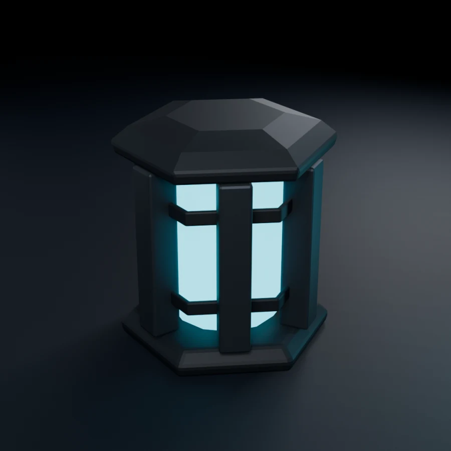
  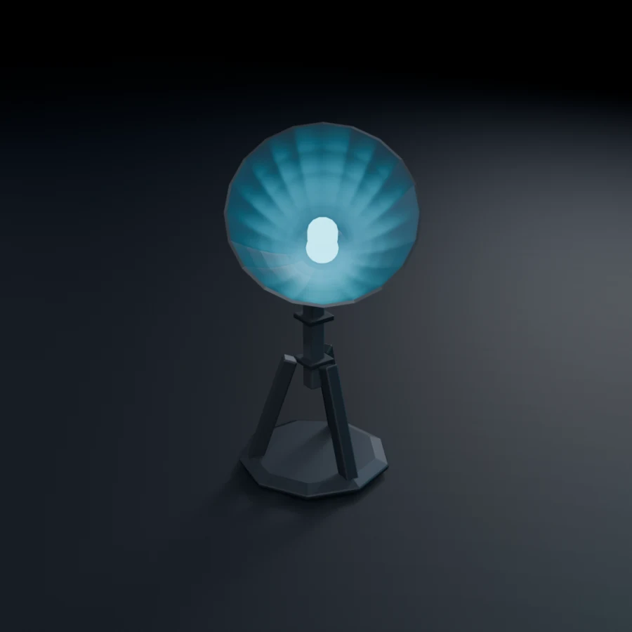
  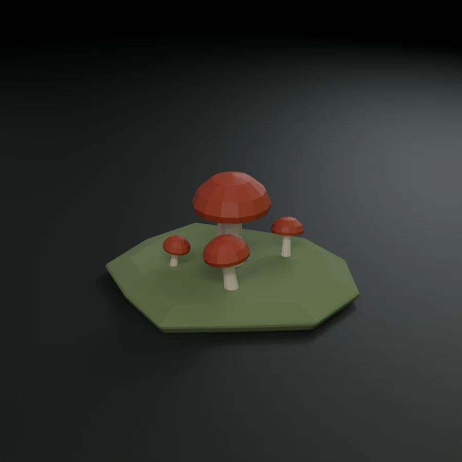
</p>

> **What this gallery is, and is not.** These assets were produced by the scripts
> in `examples/gallery/`, written to the skill's rules — see
> [Which rules the scripts obey](#which-rules-the-scripts-obey) for the audit.
>
> They were **not** produced by running the skill. The skill drives Blender over
> MCP and its core loop is interactive: `get_scene_info()` before each phase
> (rule 1), `get_viewport_screenshot()` after each modification (rule 2), and a
> prompt before anything destructive (rule 6). None of that is exercised here —
> this is `blender --background --python`, the scripted-modeling path only. Treat
> the gallery as reference output and a conventions check, not as end-to-end
> validation of the skill.

The measured optimization sizes, the rule-by-rule audit of the gallery scripts and how to reproduce them are in [`docs/gallery.md`](docs/gallery.md).

## Animate

<p align="center">
  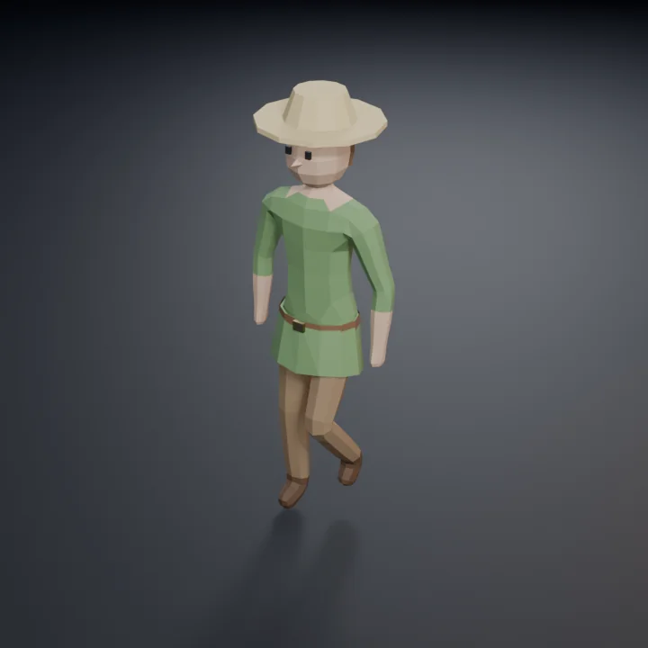
  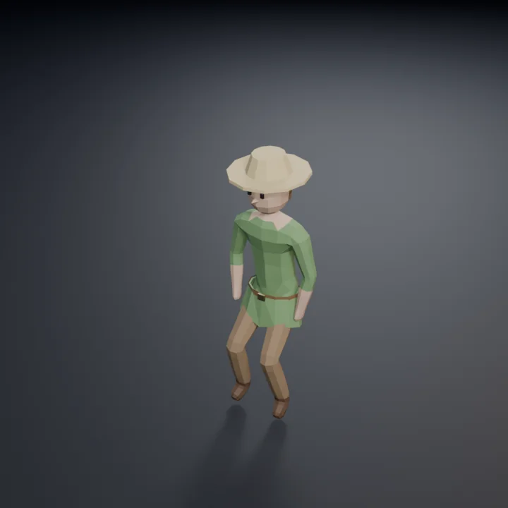
  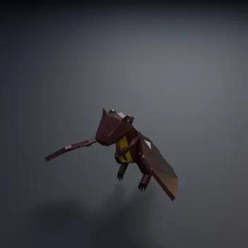
</p>
<p align="center">
  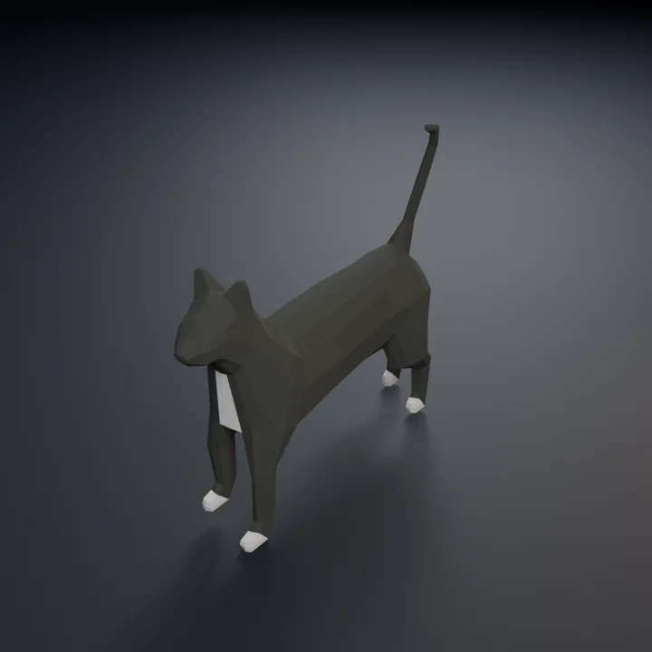
  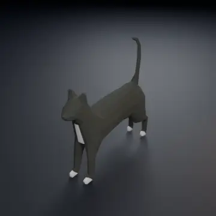
  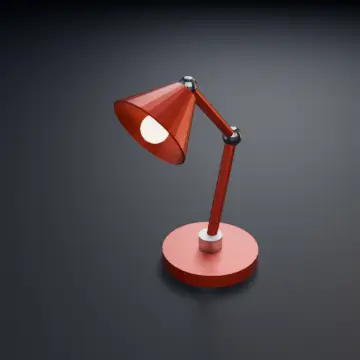
  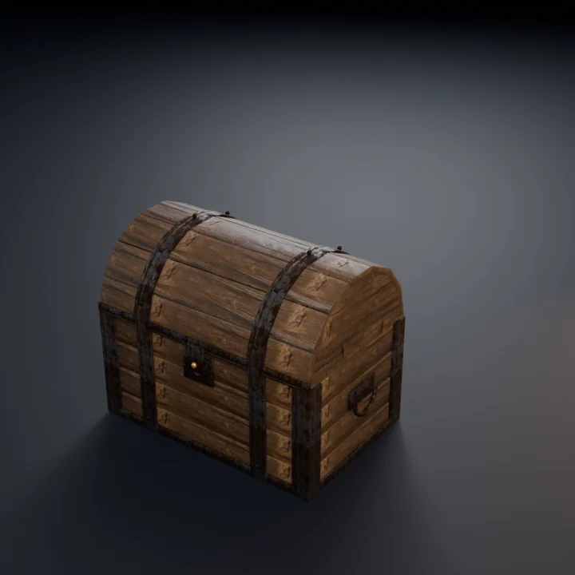
</p>

Phase 5d picks the route from the subject, because no single method held up across
all of them ([`references/animation.md`](plugin/references/animation.md) has every
measurement):

| Subject | Route | Shown above |
|---|---|---|
| Biped or winged, from a sentence | [UniMate](https://github.com/Friedrich-M/UniMate) text-to-motion, looped by `tools/motion_loop.py` | the villager, the dragon |
| Four-legged, idle and walk | `tools/quadruped.py` — a scripted, measured cycle | the cat |
| Articulated object | rigid parts keyed by script, every rotation's sign measured first | the lamp, the chest |

UniMate was measured **unusable for quadruped walking** — on a cat, a Shiba, a horse
and the model author's own robot dog, with the solver ruled out — so a quadruped never
goes to it: `unimate.py` recognises the posture and points at `quadruped.py`.

> **What this showcase is, and is not.** Each UniMate tile is the sample, out of 4,
> that `motion_loop.py` kept for looping best, then **approved by a reviewer** —
> samples vary, and some prompts tried (wave, dance, run) were left out. UniMate's
> checkpoints are **CC BY-NC 4.0: non-commercial use only**. The scripted tiles are
> deterministic. As with the gallery, these come from scripts
> (`examples/animation/showcase.sh`, assets and credits alongside), not from an
> interactive session of the skill.

## Commands

| Command | Action |
|---|---|
| `/kiln` | Full pipeline (CONFIG → EXPORT) |
| `/kiln batch` | Batch wizard → manifest → autonomous multi-asset production |
| `/kiln batch run` | Execute/resume a batch manifest (`--all`, `--asset <name>`) |
| `/kiln setup` | Environment detection + guided setup |
| `/kiln models` | List/switch Hunyuan3D models |
| `/kiln status` | Show current pipeline state |
| `/kiln search` | Search PolyHaven/Sketchfab |
| `/kiln inspect` | Inspect a 3D file (stats, poly count, materials, bbox) |
| `/kiln cleanup` | Cleanup a mesh in Blender |
| `/kiln texture` | Texture an untextured mesh |
| `/kiln optimize` | Optimize a GLB with gltf-transform/gltfpack |
| `/kiln convert` | Convert between formats (GLB↔USDZ↔FBX) |
| `/kiln help` | List all commands and usage |

## Requirements

### Required

- **Blender 4.4 or newer**, with the [Blender MCP](https://github.com/ahujasid/mcp-for-blender)
  addon running (port 9876). Install the addon with `uvx blender-mcp install-addon`.

  **4.4 is a hard floor, not a preference.** Layered actions arrived in 4.4, and the
  animation code here reaches F-curves through `action.layers[].strips[].channelbag()`;
  on 4.0–4.3 that path does not exist. Everything in this repository is measured on
  **5.0** locally and **5.2 LTS** in CI — 4.4 to 4.5 satisfy the API but are untested,
  so treat them as unverified rather than supported.

### AI generation — optional, and honest about its limits

Most assets never need it: scripted modeling, geometry nodes and marketplaces cover
props, and the bench ships all of its non-AI briefs without any generation service. When a brief does need AI
generation, this is the state measured on 2026-09-29:

| Path | Cost | Texture | State |
|---|---|---|---|
| [`tencent/Hunyuan3D-2`](https://huggingface.co/spaces/tencent/Hunyuan3D-2) HF Space | free, quota | **no** — `/generation_all` fails server-side | shape works, untextured |
| [`microsoft/TRELLIS.2`](https://huggingface.co/spaces/microsoft/TRELLIS.2) HF Space | free, quota | PBR, baked | API read live; no run completed yet |
| Local Hunyuan3D-2 | free | CUDA only | shape only on Apple Silicon, per its docs — not measured here |
| MCP-native Hunyuan3D / Rodin / Tripo | Tencent Cloud keys, or paid | yes | not measured — the skill never spends money |

- **The free cloud path is one or two generations a day.** Hugging Face's ZeroGPU
  quota is 2 minutes without an account, 3.5 with a free one; a generation asks
  60–120 s. `gradio_client` uses your saved Hugging Face token silently — kiln says
  whose account pays before the first call, and never touches the token.
- **Hunyuan3D's licence excludes the EU, the UK and South Korea** (its `LICENSE`,
  line 3). Check it before using its output in France or elsewhere in the EU.
- **Concept art** comes from the [FLUX.1-schnell](https://huggingface.co/spaces/black-forest-labs/FLUX.1-schnell)
  Space (Apache-2.0, 5.6 s an image). Pollinations, the former default, now answers
  HTTP 402 after one image.

### Optional

- **nano-banana MCP** — alternative concept art generation via Gemini (requires API key with billing)
- **gltf-transform** — `npm install -g @gltf-transform/cli` — texture compression, Draco, and the Khronos validator every export runs. Strongly recommended
- **gltfpack** — `npm install -g gltfpack` (mesh simplification, LOD generation)
- **Sketchfab API token** — free account, for marketplace downloads
- ~~**Reality Converter** / **usdzconvert**~~ — not needed: Blender exports USDZ natively

## Installation

### As a Claude Code plugin (recommended)

```
/plugin marketplace add elithril/blender-kiln
/plugin install blender-kiln@blender-kiln
```

Then run `/kiln setup` to detect your environment and install what's missing.

### As a standalone skill

```bash
git clone https://github.com/elithril/blender-kiln.git ~/.claude/skills/blender-kiln
```

Restart Claude Code, then run `/kiln setup`. The skill itself lives in `plugin/`; the
repository root links `SKILL.md`, `references` and `tools` to it, so a clone works as a
skill directory as it is. On Windows, enable symlinks in git (`core.symlinks`) or install
as a plugin.

### Layout

A plugin install ships only `plugin/` — about 0.7 MB:

```
plugin/
├── .claude-plugin/plugin.json
├── SKILL.md
├── LICENSE
├── tools/                        # fidelity_check, template_profile, quadruped, motion_loop, bind_rigid_parts, unimate (+ patch), checks
└── references/
    ├── ai-generation.md
    ├── animation.md
    ├── batch-mode.md
    ├── setup-install.md
    ├── characters.md
    ├── cli-tools.md
    ├── export-targets.md
    ├── naming-conventions.md
    ├── sourcing-strategy.md
    ├── texturing-strategy.md
    ├── reference-fidelity.md
    ├── topology-rules.md
    ├── uv-materials.md
    └── validation-checklist.md
```

## Skill structure

| File | Content | Lines |
|---|---|---|
| `plugin/SKILL.md` | Main pipeline, iron rules, MCP tool surface, commands, setup | ~1,020 |
| `plugin/references/characters.md` | Rigging patterns, animation-ready skeleton, export gotchas, Blender 5.x | ~750 |
| `plugin/references/animation.md` | Routes by subject, scripted-animation rules, quadruped cycles, UniMate install / loops / prompts | ~170 |
| `plugin/tools/quadruped.py` | Procedural quadruped idle + walk, IK-planted, measured before export (legs bent, paws in step, exact loop) | ~200 |
| `plugin/tools/motion_loop.py` | Generated clip → seamless loop (pose + direction matched, drift removed); keeps the sample that loops best | ~100 |
| `plugin/tools/bind_rigid_parts.py` | Folds bone-parented parts (eyes, props) into the skin; reports a quadruped posture for routing | ~60 |
| `plugin/tools/unimate.py` | Installs UniMate at the tested version, reports newer upstream, runs rigged GLB + prompt → animated GLBs | ~300 |
| `plugin/references/batch-mode.md` | Batch wizard, runner, iron rules 22-26, manifest format | ~460 |
| `plugin/references/texturing-strategy.md` | 4 strategies + shader recipes + bake workflow | ~360 |
| `plugin/references/reference-fidelity.md` | From a reference image: detail inventory, silhouette, attachment, measured materials, measured review | ~400 |
| `plugin/tools/fidelity_check.py` | Renders a model under a studio HDRI and measures shape and material gaps against its reference | ~245 |
| `plugin/tools/template_profile.py` | Reads a turned object's real profile off a 3D template (a generated mesh, a scan), to model from | ~120 |
| `plugin/references/validation-checklist.md` | Geometry cleanup (welding that keeps the shading) + material export audit | ~290 |
| `plugin/references/ai-generation.md` | Hunyuan3D 2.x (local + cloud), TRELLIS.2 local (measured), concept art (FLUX.1-schnell, nano-banana), free-quota and token rules | ~430 |
| `plugin/references/export-targets.md` | GLB/FBX/USDZ settings, headless CLI, post-export checklist | ~240 |
| `plugin/references/cli-tools.md` | gltf-transform, gltfpack, LOD workflow, metrics | ~210 |
| `plugin/references/uv-materials.md` | UV unwrapping, PBR channel packing | ~150 |
| `plugin/references/naming-conventions.md` | Blender + GLTF name mapping + file conventions | ~150 |
| `plugin/references/topology-rules.md` | Poly budgets, quad rules, edge flow | ~90 |
| `plugin/references/setup-install.md` | Model selection, install commands, post-install validation | ~70 |
| `plugin/references/sourcing-strategy.md` | PolyHaven (MCP or public API) + Sketchfab search patterns | ~120 |

**Total: ~4,800 lines** of production-tested 3D pipeline knowledge.

## Continuous checks

`plugin/tools/verify_docs.py` runs on every push (`.github/workflows/verify.yml`) and
checks that this documentation is still true — text only, no Blender, a few
seconds:

- iron rules form one unbroken 1..N sequence across `plugin/SKILL.md` and `batch-mode.md`
- every cited `rule N` exists **and means what the citation claims**
- the rule count above matches reality, and every line count in the structure
  table is within 15% of the file it describes
- every referenced file exists, and none point outside the plugin directory
- every README image resolves
- no bare `pip install` (it fails on any PEP 668 Python)
- the plugin manifest is valid and its `source` is a real directory
- documented commands use the invocable `/kiln <sub>` form

`plugin/tools/test_verify_docs.py` seeds each of those regressions and asserts the
checker catches it — **24/24** (20 seeded regressions, 4 that must stay silent). Every case is a mistake that was actually made
here, including two renumberings that left a reference pointing at the wrong rule.

`plugin/tools/verify_blender.py` (`.github/workflows/blender.yml`, weekly and on demand)
re-checks what needed Blender to establish — the documented `bpy` API still exists,
the Principled sockets the docs name are real, Rigify's deform-bone counts still
match the tiers PHASE 5c routes on, geometry nodes still need the modifier applied
before export, USDZ still exports natively into a conforming archive, and rule 10's weld —
the code in `validation-checklist.md`, run as written — still keeps a faceted mesh's shading
and closes the tear a split-edge mesh opens at its first pose; on synthetic rigs built in the check,
the quadruped walk stays bent and in step, a bone-parented part follows its bone once folded,
and a clip cut mid-swing loops back to its exact period. It also fails on any
Blender `DeprecationWarning` reached by the docs or the gallery — its first run
surfaced `Material.use_nodes`, slated for removal in 6.0. Each check guards a
shipped bug; this notices when a Blender release makes one wrong again.

`plugin/tools/unimate.py drift` (`.github/workflows/unimate-drift.yml`, weekly) clones
UniMate's upstream HEAD and checks kiln's patch still applies to it — the text-to-motion
model of phase 5d is a research project that changed its pipeline, checkpoints and licence
within days of kiln first measuring it.

`plugin/tools/test_fidelity_check.py` runs in the same workflow and seeds what the review tool
claims to measure — a model against its own render (IoU 0.998), the same model 20 % wider
(measured +20.3 %), an unloaded texture (refused), a `.blend` (warned), the triangle range
(kept under twice its top, a reduction proposed past it), dark metal (reported; the same
colour as non-metal, silent), metal in hard scattered islands (reported; one soft region,
silent), metal painted mostly as non-metal (reported), grain measured but never listed as a gap,
joint close-ups (a rod resting on a sphere rendered; sunk or free,
not), and `--view` and `--azimuth` on a 2 x 1 x 1 box — **27/27**. Its first run caught the tool framing views by
height only: anything wider than tall was clipped, a box measured 1:1 instead of 2:1.
`plugin/tools/test_template_profile.py` reads a seeded turned part back through
`template_profile.py` — radii, a free rod, a rod pressed against the body — **4/4**.

## Iron rules

The skill enforces 31 rules (26 core + 5 batch-specific). Key ones, by their real
number — the full text is in `plugin/SKILL.md` and `plugin/references/batch-mode.md`:

- **Rule 1** — always `get_scene_info()` before each phase
- **Rule 2** — always `get_viewport_screenshot()` at the end of every phase that
  changed geometry or materials, two angles after texturing
- **Rule 4** — never hard-cap poly count: alert if out of range, never block
- **Rule 5** — never spend money: a free service that answers HTTP 402 has stopped
  being free, so switch source; never remove a watermark
- **Rule 6** — never silently destroy: decimate, simplify, delete are always proposed
- **Rule 7** — always keep the `.blend` file
- **Rule 18** — never `export_apply=True` for glTF: modifiers balloon file size
- **Rule 19** — always run the material export audit before a glTF export
- **Rule 20** — never `gltf-transform optimize`: use individual steps
- **Rule 22** — frame the viewport before screenshotting it, or the shot shows an
  apparently empty scene
- **Rule 23** — always check integration status before searching a marketplace: a
  disabled integration answers `Unknown command type`, not "disabled"
- **Rule 25** — rename every import to the naming convention, whatever its source
- **Rule 26** — never pick a rig without measuring vertices ÷ deform bones: a
  Rigify human needs ~3,200 vertices to be worth it
- **Rule 30** — between batch assets, clear the scene by removing datablocks, never
  with `read_homefile()`

## Output

Two storage modes, configurable at pipeline start:

**Compact (default)** — minimal footprint, .blend is the recovery point:
```
generated-assets/
└── wooden-chair/
    ├── wooden-chair_original.glb
    ├── wooden-chair_final.glb
    ├── wooden-chair.blend
    └── wooden-chair_log.md
```

**Full** — all intermediate files for debug/comparison:
```
generated-assets/
└── wooden-chair/
    ├── wooden-chair_original.glb
    ├── wooden-chair_clean.glb
    ├── wooden-chair_textured.glb
    ├── wooden-chair_optimized.glb
    ├── wooden-chair_final.glb
    ├── wooden-chair.blend
    └── wooden-chair_log.md
```

**Batch mode** — assets grouped under a batch folder with manifest and report:
```
generated-assets/
└── batch-corporate-office-2026-04-02/
    ├── batch-manifest.yaml
    ├── batch-report.md
    ├── desk/
    ├── chair/
    └── keyboard/
```

At the end of a multi-asset session, Kiln proposes a cleanup of intermediate files with per-asset size breakdown.

## Contributing

Fixes are welcome — see [CONTRIBUTING.md](CONTRIBUTING.md). One rule shapes it:
**claims must be measured, not reasoned.** Fifteen bugs in this repository's own
documentation were found by running it, and none of them were visible in the text.

## License

[MIT](LICENSE) © Nicolas Dolphens
