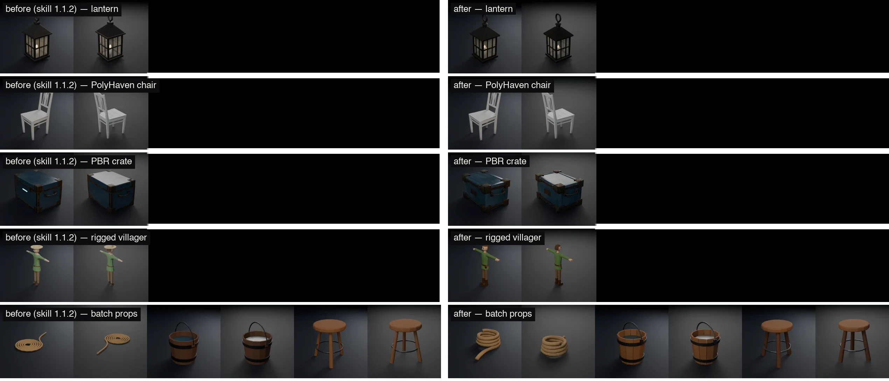
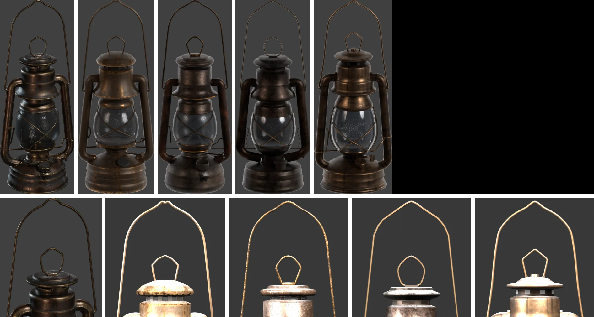
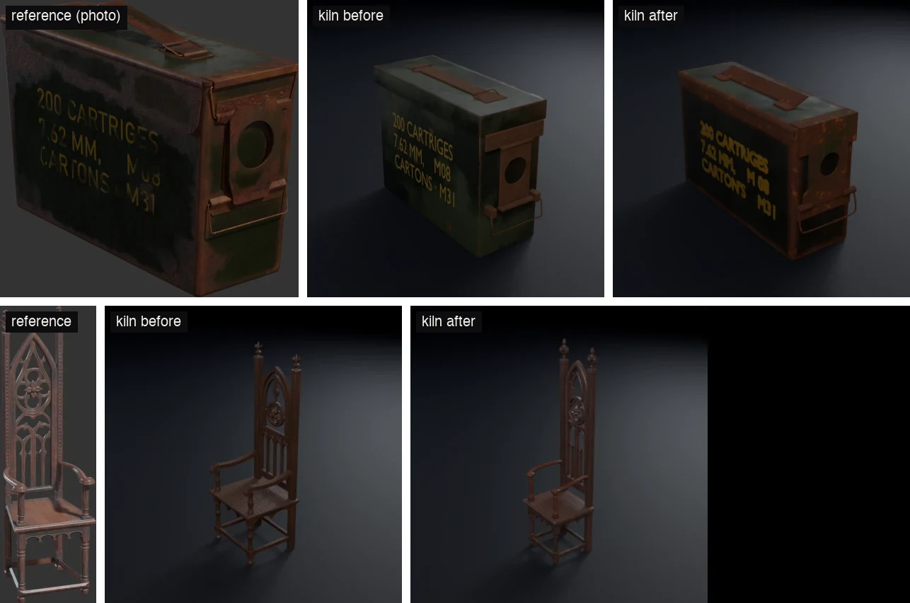

# Benchmarks — what blender-kiln ships, measured

Every number on this page was produced by the quality bench in [`bench/`](../bench/README.md)
and can be checked against the files in [`bench/results/`](../bench/results/): the shipped
GLBs under 1 MB, renders, production logs and per-run JSON. Nothing is estimated unless it
says so. Where a result is unflattering, it stays.

- [How it is measured](#how-it-is-measured)
- [1. Before and after: six briefs, two Blender MCP servers](#1-before-and-after-six-briefs-two-blender-mcp-servers)
- [2. The two Blender MCP servers, same skill](#2-the-two-blender-mcp-servers-same-skill)
- [3. From a photo: seven iterations on one lantern](#3-from-a-photo-seven-iterations-on-one-lantern)
- [4. kiln against an image-to-code tool](#4-kiln-against-an-image-to-code-tool)
- [5. Does it generalise: a crate and a chair](#5-does-it-generalise-a-crate-and-a-chair)
- [6. Does the skill fire when it should](#6-does-the-skill-fire-when-it-should)
- [What the measurements taught](#what-the-measurements-taught)
- [Limits](#limits)
- [Reproduce](#reproduce)

## How it is measured

**Sessions.** Each brief runs as one headless Claude Code session (`claude -p`, Opus 5.5), with
no user settings, a throwaway Blender profile and a pinned MCP server. The skill is interactive,
so every parameter it would ask for is given up front; its auto mode does the rest.

**The file, not the log.** Each shipped `*_final.glb` is re-imported into Blender and measured
by [`bench/measure.py`](../bench/measure.py): triangles, fused (non-manifold) edges, grounding,
textures that survived export, rig structure and a deformation probe. The session's own report
is never the source of a number.

**Against a photo.** [`tools/fidelity_check.py`](../tools/fidelity_check.py) — also used by the
skill itself — renders the model at the photo's angle under a Poly Haven studio HDRI and compares
silhouette and material per height band. It is tested on seeded inputs
([`tools/test_fidelity_check.py`](../tools/test_fidelity_check.py), 12/12).

**Against the truth.** The photo references are Poly Haven previews (CC0), so the real 3D asset
exists. [`bench/gt_compare.py`](../bench/gt_compare.py) scores each reconstruction against it from
front, back, left, right and top, finds the model's orientation, and reports its real size. **A
session never sees the truth** — it works from the photo, as a user would. The truth is the
marking scheme.

**Cost** is the CLI's API-equivalent figure (`total_cost_usd`). On a Claude subscription it is
not billed; it is the comparable measure of how much a run consumes.

## 1. Before and after: six briefs, two Blender MCP servers

Six fixed briefs, one per pipeline path — scripted modeling, AI generation, a PolyHaven import,
PBR texturing, a rigged character, batch mode. Skill 1.1.2 against the current branch, Blender
5.2.2, one run per brief.

| Five briefs without AI | ahujasid's MCP, before → after | Official Blender Lab MCP, before → after |
|---|---|---|
| Shipped size | 32.85 MB → **0.96 MB** (÷34) | 3.87 MB → **0.75 MB** (÷5) |
| GLBs compressed (Draco / WebP) | 0 of 7 → **7 of 7** | 0 of 7 → **7 of 7** |
| Defects the measure found | 2 → 1 (a stool 6 mm below the ground) | 2 → **0** |
| Cost for the five | $6.49 → $7.34 (+13 %) | $5.82 → $7.81 (+34 %) |

<p align="center"></p>
<p align="center"><sub><b>Left half: before</b> (skill 1.1.2) · <b>right half: after</b>. One row per brief — lantern, PolyHaven chair, PBR crate, rigged villager, batch props — each object rendered from two angles under the same studio light. The Lab MCP's sheet: <a href="../bench/results/final/before-after-lab.webp">before-after-lab.webp</a>.</sub></p>

No visual regression on either server. The skill now does the work it used to skip —
optimization, validation, re-checks — and pays for it in turns.

**The AI brief ships no GLB, before or after, by design.** Generation works (Hunyuan3D's
Space, 275,000 triangles); the session then proposes decimation options with previews and
waits for the user — rule 6, never destroy silently. A headless run cannot answer. Both
sessions also flagged, unprompted, that Hunyuan3D's licence excludes the EU.

Details: [`bench/results/final/`](../bench/results/final/README.md).

## 2. The two Blender MCP servers, same skill

Skill 1.1.2 unchanged, six briefs on each server.

| | ahujasid 2.0.0 | Official Blender Lab MCP |
|---|---:|---:|
| GLBs shipped | 7 | 7 |
| Cost ≈ | $7.74 | **$6.99** (−10 %) |
| Turns | 197 | **136** |
| Fused edges shipped | 0 | 84 (one lantern) |

kiln runs on the Blender Foundation's server — the one behind Claude's Blender connector —
with no change: sessions mapped the tool names themselves and reached PolyHaven through its
public API when the server had no PolyHaven tools. The skill now documents both paths.
Details: [`bench/results/mcp-comparison-2026-09-29.md`](../bench/results/mcp-comparison-2026-09-29.md).

## 3. From a photo: seven iterations on one lantern

One reference — Poly Haven's `Lantern_01` preview, photographed from about 15° above — and the
same brief each time. Each version is the skill after the previous one's findings.

<p align="center"></p>
<p align="center"><sub><b>Top row, left to right:</b> the reference photo · kiln v3 · kiln v6 re-exported · kiln v7 · img2threejs — all rendered at the photo's ~15° angle under the same studio HDRI. <b>Bottom row:</b> the same versions, close-up on the bail and top loop (the reference crop on the left). Every version up to v6: <a href="../bench/results/lantern-iterations/">lantern-iterations/</a>.</sub></p>

| | truth, 5 views | height vs real | saturation (ref 0.32) | tris | cost |
|---|---:|---:|---:|---:|---:|
| v1 — before the loop | 0.830 | +23 % | 0.44 | 6,852 | $1.90 |
| v3 — measured review | **0.876** | +33 % | 0.34 | 10,688 | $2.83 |
| v4 — traced wires, layered textures | 0.843 | +29 % | 0.33 | 8,044 | $4.06 |
| v5 — size and camera angle | 0.848 | +2 % | 0.38 | 8,572 | $5.63 |
| v6 — as shipped | 0.862 | +2 % | **0.12** | 8,836 | $4.15 |
| **v7 — sRGB export fix** | 0.861 | **+2 %** | **0.31** | 7,552 | **$3.52** |

What each step taught is in [What the measurements taught](#what-the-measurements-taught).
Two versions are worth reading closely:

- **v4 fitted the photo best (0.898) and the real object worse than v3.** It had copied the
  photo's perspective into the geometry: a base 30 % too tall. A photo score above what the
  real object itself scores (~0.80) is overfitting, not progress.
- **v6 was reviewed at the right colour and shipped near black.** Blender's glTF exporter writes
  a linear float base-colour image into its PNG without the sRGB transfer (linear 0.2 becomes
  byte 51, not 124). Re-exported through a conversion, the same file reads 0.30.

Details: [`bench/results/lantern-iterations/`](../bench/results/lantern-iterations/README.md).

## 4. kiln against an image-to-code tool

[img2threejs](https://github.com/img2threejs/img2threejs) (Apache-2.0) rebuilds a reference
image as procedural Three.js code, through eight vision-reviewed passes. Same reference image,
same instruction; its code was exported to GLB by the bench with Three.js's `GLTFExporter`.

| Lantern | kiln v7 | img2threejs |
|---|---:|---:|
| truth, 5 views | 0.861 | 0.866 |
| height vs real | +2 % | +52 % |
| texture detail (ref 0.032) | 0.018 | **0.026** |
| triangles | **7,552** | 41,736 |
| cost | **$3.52** | ≈ $10, **stopped after pass 3 of 8** |

Likeness is comparable; img2threejs keeps the edge on fine surface detail, kiln on size, weight
and cost — about 2.8× cheaper against a run that was a third done. Its cost is estimated: the
run was stopped, and its tokens were priced with rates fitted on 28 kiln sessions of known cost
(max error 9.7 %). kiln integrates none of its code; several of its techniques — traced wires,
layered texture fields, a frosted-glass recipe — were measured and adopted.

## 5. Does it generalise: a crate and a chair

The lantern loop could have fitted the skill to one lantern. The same skill, before and after,
on two other Poly Haven references:

<p align="center"></p>
<p align="center"><sub><b>Left to right:</b> the reference photo · kiln before the lantern loop · kiln after. <b>Top:</b> Poly Haven's ammo_box. <b>Bottom:</b> Poly Haven's WoodenChair_01.</sub></p>

| | truth | height vs real | cost |
|---|---:|---:|---:|
| ammo box, before | 0.854 | +30 % | $1.97 |
| **ammo box, after** | **0.888** | **+8 %** | $3.10 |
| gothic chair, before | 0.445 | −22 % | $1.94 |
| **gothic chair, after** | **0.673** | **−8 %** | $4.41 |

The chair's back now carries the reference's pointed arch, rose and tracery; it is still 11–16 %
too narrow and shallow. Its side views are left out of its score: an openwork object seen from the
side is thin posts, and every orientation of a good reconstruction overlaps 0.12–0.16 there.

Details: [`bench/results/generalisation/`](../bench/results/generalisation/README.md).

## 6. Does the skill fire when it should

A skill is chosen from its one-line description. Twelve prompts written as users write them,
eight that should trigger kiln and four that should not, plus six held-out prompts written before
the new description was drafted:

| | old description | new description |
|---|---:|---:|
| should fire, main set | 6 / 8 | **8 / 8** |
| should fire, held-out | 3 / 4 | **4 / 4** |
| false positives | 0 / 4 | **0 / 6** |

The old one missed every request about an existing file — "shrink this 40 MB GLB", "convert to
USDZ", "generate LODs" — though kiln has a command for each. Data: [`bench/results/trigger/`](../bench/results/trigger/).

## What the measurements taught

Each of these is now a rule in the skill, and each came from a number, not an opinion:

1. **Measure instead of eyeballing.** Reviewing by eye, sessions over-corrected twice: too bright
   and blotchy, then grey at half the reference's saturation.
2. **Trace thin parts from the pixels.** A wire traced from the image lands within 0.7 mm of hand-
   measured points; a guessed one drifts and kinks.
3. **Layer texture fields, and give grime a direction.** Colour, roughness, relief and cavity as
   independent fields; streaks along a turned part's profile.
4. **Settle what one photo cannot say before modeling:** the real size, the camera's elevation
   and azimuth, and more views when the back will be seen.
5. **Never fit the photo harder than the real object would.** Close the listed gaps; stop.
6. **Measure the file that ships.** A float colour bake exported black; only the GLB showed it.
7. **Scale the procedure to the asset.** A background prop does not need eight measures.

The full record is in [`CHANGELOG.md`](../CHANGELOG.md).

## Limits

- **One run per brief.** A model is not deterministic; a difference of ±0.01 between two versions
  is not significant. No version was repeated to measure that variance.
- **Five references.** Six fixed briefs, three Poly Haven photos. Two of them are 3/4 views; none
  is a real photograph of a real object.
- **The studio light is not the photo's.** Luminance and highlights depend on it — the real asset
  itself reads +0.05 luminance against its own preview — so those two numbers are alarms, not
  targets. Saturation and shape held.
- **The AI path is not measured end to end.** Its free cloud quota is one or two generations a
  day, and rule 6 stops a headless run at decimation. A local TRELLIS.2 path is documented as a
  candidate, not yet measured.
- **Fine texture detail** still sits near 0.018 against the reference's 0.032.

## Reproduce

```bash
python3 bench/test_measure.py                          # the instrument first
python3 bench/run.py mylabel                           # the six briefs; BENCH_MCP=lab for the Lab server
python3 bench/report.py baseline-52 mylabel            # compare with a recorded label
blender -b --factory-startup --python-exit-code 1 --python bench/gt_compare.py -- \
  --truth <poly-haven-asset>.gltf --model <asset>_final.glb --label mine
```

Needs Blender 4.4+ (measured on 5.2.2), `gltf-transform`, `cwebp`, and Claude Code. A session
costs about $1–5 in API-equivalent usage.
